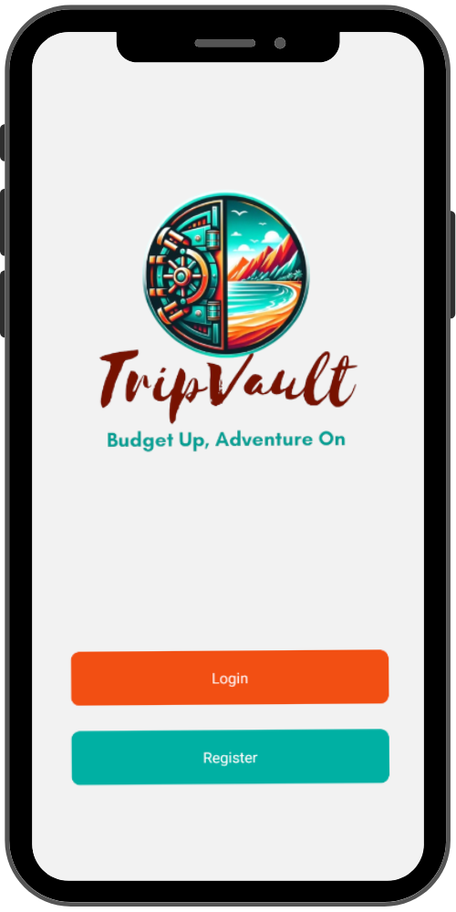
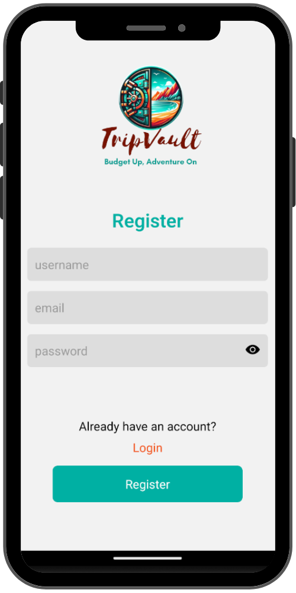
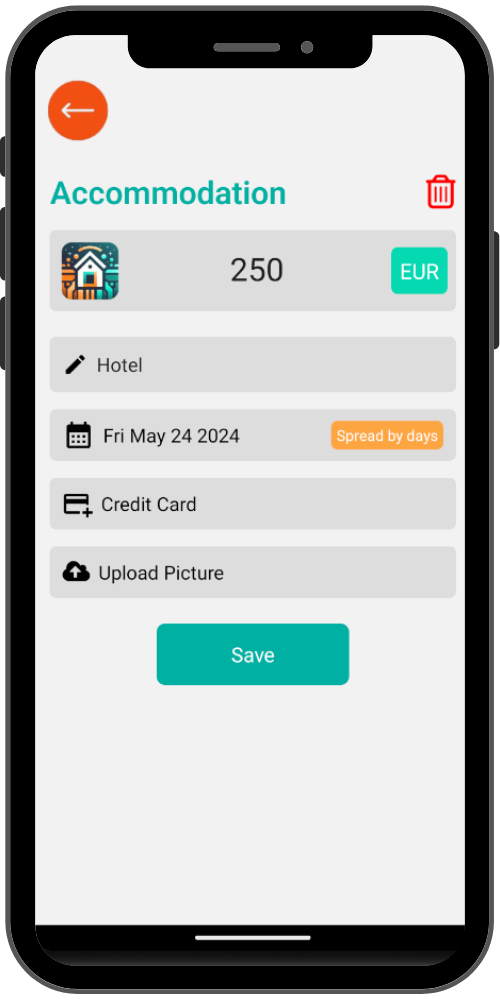
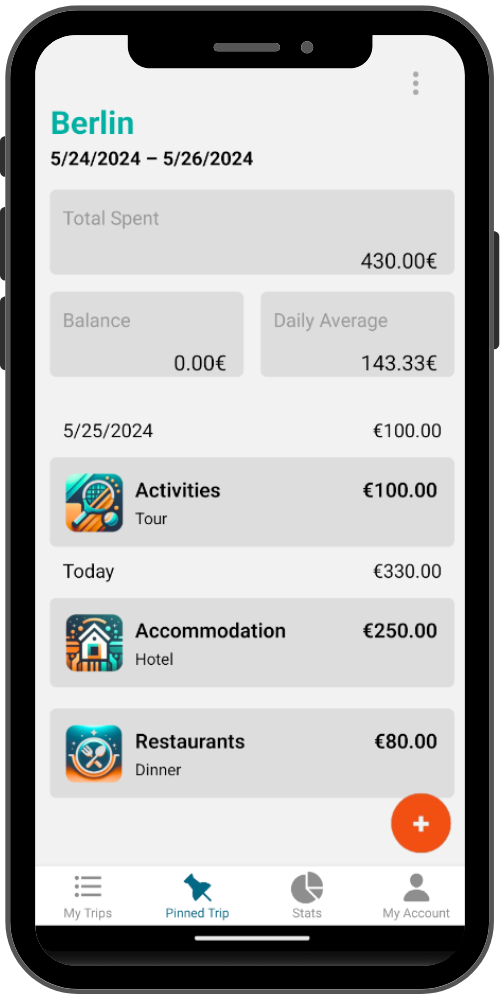

# 🧳 Trip Vault

Welcome to Trip Vault!  
This mobile application is designed to simplify the process of tracking and managing your travel expenses.  
Our app helps you keep all your expenses organised and easily accessible.



## Table of Contents

- [Features](#features)
- [Instructions](#instructions)
- [Dependencies](#dependencies)
- [Installation](#installation)
- [Troubleshooting](#troubleshooting)
- [Contributing](#contributing)
- [Authors](#authors)
- [License](#license)

## Features

- **Expense Tracking**  
  Record and categorise your travel expenses with ease.
- **Receipt Uploads**  
  Capture and store photos of your receipts directly in the app.
- **Currency Conversion**  
  Automatically convert expenses to your home currency.
- **Reports**  
  Generate detailed expense reports to monitor your spending.
- **Multi-Trip Support**  
  Manage expenses for multiple trips simultaneously.

## Instructions

- **Create an Account**  
  Sign up with your email or username, and login with your account.  
  
- **Add a Trip**  
  Unlock your first trip to begin your journey with details.  
  
- **Track Expenses**  
  Start adding your expenses by entering the details, including category, date, and payment method.  
  Don't forget to upload your receipts for easy reference.  
  
- **Generate Reports**  
  Go to the "Pinned Trip" to view and generate detailed expense reports.  
  

- **Add a New Trip**  
  Ready for your next adventure?  
  Head over to "My Trips" to create a new trip and start planning your next memorable experience.

## Dependencies

### Backend (Server)

- **Node.js**: JavaScript runtime built on Chrome's V8 JavaScript engine, used for building fast and scalable server-side applications.
- **Express**: Fast, unopinionated, minimalist web framework for Node.js, used to build the API.
- **Mongoose**: Elegant MongoDB object modeling for Node.js, used to interact with MongoDB.
- **bcrypt**: Library for hashing passwords, used for secure user authentication.
- **jsonwebtoken**: Library to generate and verify JSON Web Tokens (JWTs), used for user authentication.
- **dotenv**: Module to load environment variables from a `.env` file into `process.env`.
- **cors**: Middleware to enable Cross-Origin Resource Sharing, allowing the frontend to communicate with the backend.
- **express-validator**: A set of express.js middlewares that wraps validator.js, used for validating and sanitizing user input.
- **fs-extra**: Module that extends the Node.js `fs` module with additional functionality.
- **morgan**: HTTP request logger middleware for Node.js, used for logging requests to the server.
- **multer**: Middleware for handling `multipart/form-data`, used for uploading images.

### Frontend (Client)

- **React Native**: Framework for building native apps using React.
- **Expo**: Framework and platform for universal React applications, used to streamline development.
- **React Navigation**: Library for routing and navigation in React Native apps.
- **Axios**: Promise-based HTTP client for making requests to the backend API.
- **@expo/vector-icons**: Set of icons to use in the app.
- **Luxon**: Library for working with dates and times, used for date manipulation.
- **react-native-async-storage**: Local storage system for React Native.
- **react-native-date-picker** and **react-native-datetimepicker**: Components for date and time picking.
- **nativewind**: Utility-first CSS framework to style React Native applications.
- **react-native-elements**: UI toolkit for React Native, providing ready-to-use components.
- **tailwindcss**: Utility-first CSS framework, used in conjunction with nativewind for styling.

## Installation

### Backend

1. **Clone the repository**
   ```bash
   git clone https://github.com/MarinnaPereira/trip-vault.git
   ```
2. **Navigate to the server directory**
   ```bash
   cd trip-vault/server
   ```
3. **Install dependencies**
   ```bash
   npm install
   ```
4. **Create a .env file**
   ```bash
   PORT=your_desired_port
   MONGO_URI=your_mongo_uri
   JWT_SECRET=your_jwt_secret
   ```
5. **Run the server**
   ```bash
   npm run dev
   ```

### Frontend

1. **Navigate to the client directory**
   ```bash
   cd trip-vault/client
   ```
2. **Install dependencies**
   ```bash
   npm install
   ```
3. **Create a .env file**
   ```bash
   BASE_URL='http://your_backend_server_url:port'
   CURRENCY_API_KEY='your_currency_api_key'
   ```
4. **Start the development server**
   ```bash
   npm start
   ```

## Troubleshooting

- **Ensure MongoDB is running**  
  Make sure you have MongoDB installed and running on your machine or provide a valid connection string in the MONGO_URI environment variable.
- **Check your environment variables**  
  Verify that all required environment variables are correctly set in your .env files for both backend and frontend.
- **Dependencies**  
  Ensure all dependencies are installed correctly.  
  Run npm install in both trip-vault/server and trip-vault/client directories.

## Authors

- <a href="https://github.com/DepyRigadopoulouKeighran" target="_blank">Depy Rigadopoulou Keighran</a>
- <a href="https://github.com/JFujie" target="_blank">Julian Fujie</a>
- <a href="https://github.com/MarinnaPereira" target="_blank">Marinna Pereira</a>
- <a href="https://github.com/yukosuga" target="_blank">Yuko Suga</a>

## License

This project is licensed under the <a href="https://opensource.org/licenses/MIT/" target="_blank">MIT License</a>.
